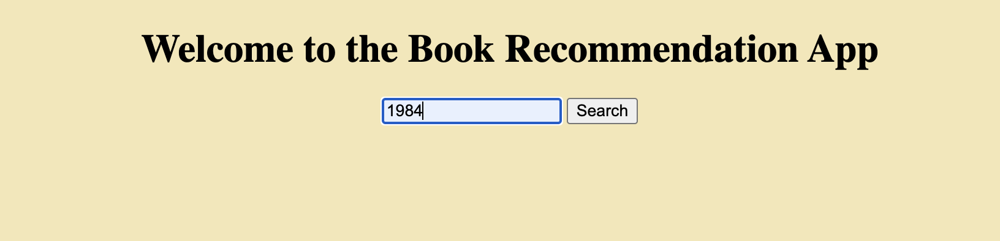

# Mini-Project 12: Dockerized Application
---
##### The purpose of this project is to create a python application containerized with a dockerfile. This project will demonstrate running the application within a docker container (using docker run terminal commands),and build a docker image in a CI/CD pipeline, which will be pushed to Docker Hub or other container management service.
---
### Requirements
- [x] Application Functionality
- [x] CI/CD
- [x] Docker Configuration

---
### File Structure
- Project Folder
    - .devcontainer
        - devcontainer.json
        - Dockerfile
    - .github
        - main.yml
    - .gitignore
    - app.py
    - Makefile
    - README.md
    - requirements.txt

---
### App setup
##### To get the app set up, a .env file must be used to hide dockerhub login information and the image name, for convenience. To activate the app from the terminal, a few Makefile commands must be run:

##### 1. Make login: this command takes hidden login information from github secrets (and/or a .env file) to login to Dockerhub

##### 2. Make build: this command will build the image, and upon opening Dockerhub, the user will be able to see both a container and an image

##### 3. Make run: this command "activates" the app from the docker container and image, and the Flask site will now be active for use

##### 4. Make clean: finally (and an optional command), this one will remove the docker image from the container, unless the user wants to delete it manually through the Docker app

#### Example of Running Make Build in the Terminal:

#### Example of Running Make Run in the Terminal:

---
### App Use
##### The app has a simple interface, which makes it easy to use. The user enters a book title in the search bar, and hits the submit button. The search results page is then loaded, which displays any matching results to the search. The user can scroll/browse on this page, or click the "book details" link to be taken to another page with more information about a specific book. Due to the nature of the API, some books do not have covers or additional information provided. They will still appear on the search results page. 

#### Homepage and Search Bar

#### Page that Returns the Search Results*

###### The page is scrollable, so more results are returned that do not match the exact search title

#### Book Details Page!
[alt text](screenshots/book_details.png)